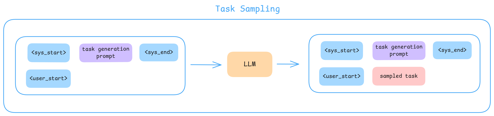
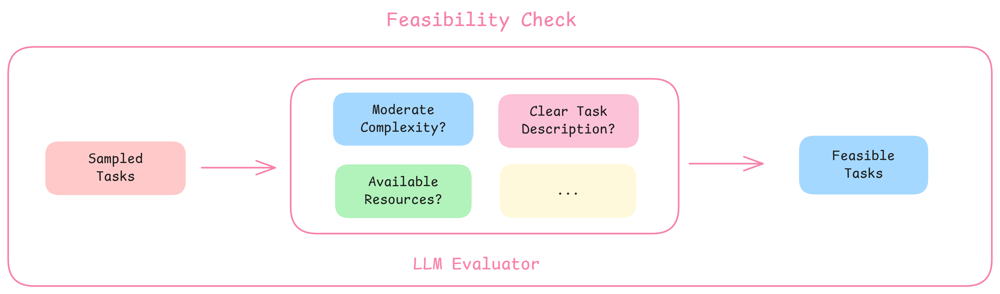
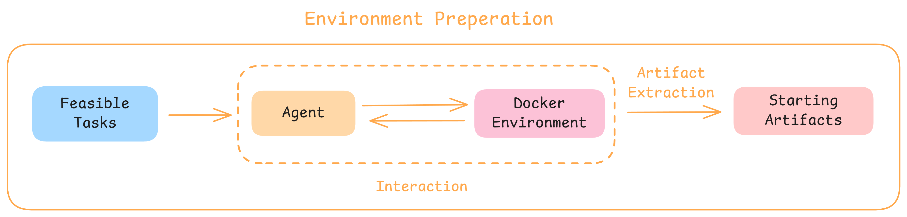

## LiteCoder

LiteCoder stems from our efforts to develop capable small and medium-sized code agent models. Our goal is to push the boundaries of what lightweight models can achieve.

In this initial release, we present **LiteCoder-Terminal-preview**, a series of models specialized in terminal interactions. 

**Notably, our [LiteCoder-4b-Terminal-preview](https://huggingface.co/Lite-Coder/LiteCoder-4b-Terminal-preview) model achieves competitive results using fewer than 1,000 training samples.** By relying entirely on a fully synthetic pipeline—without converting any existing datasets—we were able to secure significant gains on the challenging **Terminal Bench**, matching the performance of leading open-source models with extreme data efficiency.

## Released Artifacts

| 2025/12/17 |  |  |
| --- | --- | --- |
| LiteCoder-4b-Terminal-preview | Model | https://huggingface.co/Lite-Coder/LiteCoder-4b-Terminal-preview |
| LiteCoder-SFT-Terminal-preview | Dataset | https://huggingface.co/datasets/Lite-Coder/LiteCoder-SFT-Terminal-preview |

## Data Construction Pipeline

To build a robust terminal agent model, we developed a rigorous data synthesis pipeline consisting of three stages: **Task Curation**, **Environment Preparation**, and **Trajectory Generation**.

### Task Sampling


In the first version of our data, we established a taxonomy covering seven core domains of terminal usage: `ai_ml`, `build_tools`, `data_science`, `networking`, `security`, `system_admin`, and `version_control`.

Based on the taxonomy, We adapt [MAGPIE](https://arxiv.org/abs/2406.08464)-like method to synthesize long-horizon agentic tasks. By feeding the model a domain-specific system message followed by the standard chat template prefix for a user turn (e.g., `<|user|>`), the model "autocompletes" the sequence, generating a plausible and high-quality task tailored to the specified domain.



### Feasibility Check

To ensure data integrity, we employ an LLM-as-a-Judge to validate raw tasks. This stage evaluates entries against criteria—including **complexity balance**, **clarity of specification**, and **resource availability**—filtering out unfeasible or ambiguous tasks to maintain a high-quality task set.



### Environment Preparation

Many terminal tasks (e.g., fixing a bug in an existing repo or managing git conflicts) rely on specific starting states. To address this, we utilize an agent to interactively generate the necessary starting artifacts within a Docker container. Once setup is complete, we extract the final state to serve as the initial environment for the actual task execution.



### Trajectory Generation

We utilize the **Harbor** framework to generate trajectories based on the curated tasks using strong models as the teacher. We further filter out trajectories exhibiting looping behavior.

### Implementation

We employ `Kimi-K2-Instruct-0905` for task sampling and `MiniMax-M2` for environment preparation and trajectory generation.

## Performance

Our models achieve competitive results on **Terminal Bench**, significantly outperforming general-purpose models of similar (and even larger) sizes.

**Terminal Bench 1.0 Performance**

| **Model** | **Agent** | **Results** |
| --- | --- | --- |
| **LiteCoder-30a3b-Terminal-preview** | Terminus 2 | **18.75%** |
| Qwen3-30B-A3B-Nex-N1 | Terminus 2 | 18.75% |
| **LiteCoder-4b-Terminal-preview** | Terminus 2 | **13.75%** |
| Qwen3-30B-A3B-Instruct | Terminus 2 | 12.5% |
| Qwen3-4B-Instruct | Terminus 2 | 5.0% |

**Terminal Bench 2.0 Performance**

| **Model** | **Agent** | **Results** |
| --- | --- | --- |
| **LiteCoder-30a3b-Terminal-preview** | Terminus 2 | **5.6%** |
| **LiteCoder-4b-Terminal-preview** | Terminus 2 | **3.3%** |
| Qwen3-32B | Terminus 2 | 1.9% |
| InternLM3-8B-Nex-N1 | Terminus 2 | 0% |
| Qwen3-8B | Terminus 2 | 0% |

## Findings

1. **Environment Adaptability:** High-performing models show strong capability in interpreting system feedback (stdout/stderr) and dynamically adjusting their strategies, rather than simply following a rigid plan.
2. **Context Maintenance:** Successful agents maintain coherence over long interaction turns without losing track of the original objective.
3. **Scaffolding Sensitivity:** We identified a significant sensitivity to the agent framework. Models trained heavily within a specific scaffolding (prompt structure/tool definition) struggle to generalize when transferred to different agent frameworks. This highlights the importance of framework-agnostic training data.

## Citation

```latex
@misc{LiteCoder Team,
  title={LiteCoder: Advancing Small and Medium-sized Code Agents},
  author={Xiaoxuan Peng and Xinyu Lu and Kaiqi Zhang and Taosong Fang and Boxi Cao and Yaojie Lu},
  year={2025},
}
```

## Future Directions

- **Scaling Environments:** Expanding the diversity of Docker environments and teacher models to improve generalization.
- **Agentic RL:** Implementing Reinforcement Learning specifically for multi-turn agentic workflows.

## Team & Contributions

- **Xiaoxuan Peng:** Main Contributor
- [Xinyu Lu](https://scholar.google.com/citations?user=_OsLG8EAAAAJ&hl=zh-CN)**:** Project Lead
- **Kaiqi Zhang:** Contributor
- **Taosong Fang**: Contributor
- **Boxi Cao:** Contributor
- **Yaojie Lu:** Contributor

## Acknowledgements

LiteCoder builds upon multiple open-source projects, including [Harbor](https://github.com/laude-institute/harbor). The models are trained using [AutoAlign](https://github.com/icip-cas/AutoAlign).

## Join Us

Join the discussion on our [Discord](https://discord.gg/EX9qZe8B).