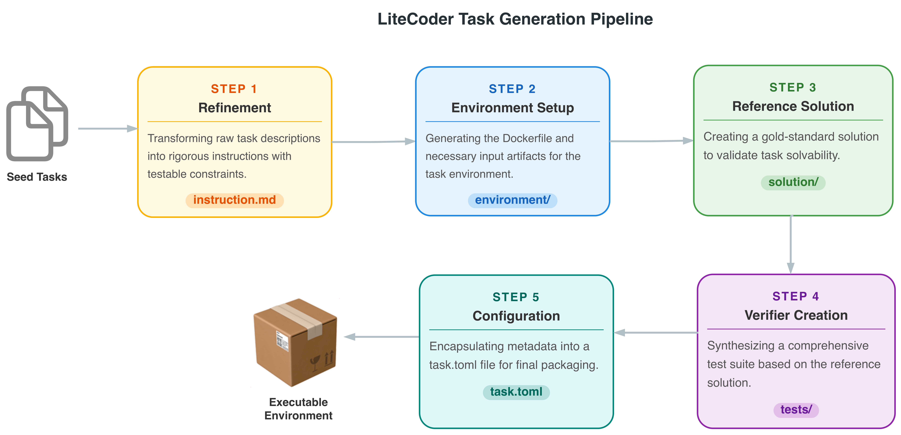
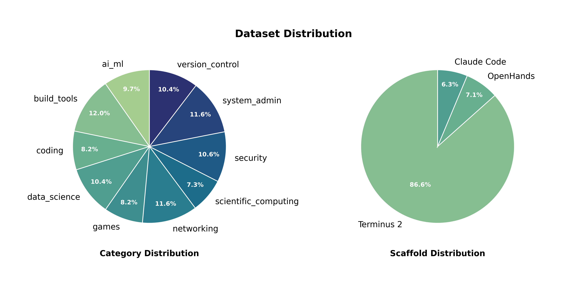

# LiteCoder
LiteCoder stems from our efforts to develop capable small and medium-sized code agent models. Our goal is to push the boundaries of what lightweight models can achieve.

Today, we are releasing LiteCoder-Terminal-SFT, featuring improved performance compared to the [previous preview release](https://www.notion.so/2b997d2e1a8b807c95e2d983c92f441f?pvs=21) across multiple Terminal benchmarks. Alongside the model, we release our full training dataset of 11,255 trajectories, generated using multiple harnesses and featuring broader domain coverage. Building upon this data, we also open-source 602 standard Harbor terminal environments, equipped with complete test cases to facilitate further RL training.

## **Released Artifacts**

| 2026/04/13 | Type | Link |
| --- | --- | --- |
| LiteCoder-Terminal-30b-a3b-sft | Model | [**https://huggingface.co/Lite-Coder/LiteCoder-Terminal-30b-a3b-sft**](https://huggingface.co/Lite-Coder/LiteCoder-Terminal-30b-a3b-sft) |
| LiteCoder-Terminal-4b-sft | Model | [**https://huggingface.co/Lite-Coder/LiteCoder-Terminal-4b-sft**](https://huggingface.co/Lite-Coder/LiteCoder-Terminal-4b-sft) |
| LiteCoder-Terminal-SFT | Dataset | [**https://huggingface.co/datasets/Lite-Coder/LiteCoder-Terminal-SFT**](https://huggingface.co/datasets/Lite-Coder/LiteCoder-Terminal-SFT) |
| LiteCoder-Terminal-World-Model-SFT | Dataset | [**https://huggingface.co/datasets/Lite-Coder/LiteCoder-Terminal-World-Model-SFT**](https://huggingface.co/datasets/Lite-Coder/LiteCoder-Terminal-World-Model-SFT) |
| LiteCoder-Terminal-RL-preview | Dataset | [**https://huggingface.co/datasets/Lite-Coder/LiteCoder-Terminal-RL-preview**](https://huggingface.co/datasets/Lite-Coder/LiteCoder-Terminal-RL-preview/tree/main) |
| icip-cas/LiteCoder | Code | [**https://github.com/icip-cas/LiteCoder**](https://github.com/icip-cas/LiteCoder) |

## What’s New

- **Taxonomy expansion:** Introducing new task categories to cover a broader range of terminal interactions.
- **Data scale expansion:** Scaling from a sub-1k setup to **11,255** **total trajectories**.
- **Environment synthesis:** Converting text-only task descriptions into executable terminal environments.
- **Scaffold expansion:** Moving from **Terminus-only** training to a **multi-scaffold** setting.
- **Improved results:** Higher performance on **Terminal** **Bench** **1.0** **/** **2.0 / Pro**, with **pass@4** results also reported.

## Taxonomy Expansion

We expanded the task taxonomy to cover a broader range of real-world terminal interactions, introducing 3 new categories: **coding**, **scientific/numerical computing,** and **games**. This ensures the model is exposed to highly diverse scenarios, ranging from rigorous developer workflows to the dynamic, state-driven environments typically found in terminal games.

## Environment Synthesis

The lack of high-quality, executable training environments is currently a major challenge for training terminal agents. Raw task descriptions lack the execution feedback required for techniques like rejection sampling and reinforcement learning, so an executable environment is essential. We implemented a five-stage synthesis pipeline to convert sampled tasks into the Harbor format using the Claude Agent SDK:



- **Refinement:** Transforming raw task descriptions into rigorous instructions with testable constraints.
- **Environment Setup:** Generating the Dockerfile and necessary input artifacts.
- **Reference Solution:** Creating a gold-standard solution to validate solvability.
- **Verifier Creation:** Synthesizing a comprehensive test suite based on the reference solution.
- **Configuration:** Encapsulating metadata into a `task.toml` file.

## Scaffolding Extension

Given the vast array of agent scaffolds, a robust model must be able to adapt to diverse setups. To improve cross-scaffold generalization, we expanded our trajectory collection beyond the initial Terminus-only setup. The updated training pipeline now integrates trajectories from popular frameworks like Claude Code and OpenHands.

## Results

To ensure the reliability of our evaluation, the reported Pass@1 scores represent the average performance across four independent runs in Terminal Bench 1.0 and 2.0.

### Terminal Bench 1.0 Performance

| Model | Agent | pass@1 | pass@4 |
| --- | --- | --- | --- |
| **LiteCoder-Terminal-30b-a3b-sft** | Terminus 2 | **24.38%** | **30%** |
| Qwen3-30B-A3B-Nex-N1 | Openhands | 18.44% | 32.5% |
| LiteCoder-30a3b-Terminal-preview | Terminus 2 | 16.56% | 27.5% |
| Qwen3-30B-A3B-Instruct | Terminus 2 | 16.56% | 28.75% |
| **LiteCoder-Terminal-4b-sft** | Terminus 2 | **13.44%** | **30%** |
| OpenThinker-Agent-v1 | Terminus 2 | 11.25% | 25% |
| LiteCoder-4b-Terminal-preview | Terminus 2 | 9.38% | 20% |
| Qwen3-4B-Instruct | Terminus 2 | 6.25% | 15% |

### Terminal Bench 2.0 Performance

| Model | Agent | pass@1 | pass@4 |
| --- | --- | --- | --- |
| **LiteCoder-Terminal-30b-a3b-sft** | Terminus 2 | **12.36%** | **23.60%** |
| Qwen3-30B-A3B-Nex-N1 | Openhands | 12.36% | 23.60% |
| LiteCoder-30a3b-Terminal-preview | Terminus 2 | 6.18% | 13.75% |
| **LiteCoder-Terminal-4b-sft** | Terminus 2 | **5.62%** | **12.36%** |
| Qwen3-30B-A3B-Instruct | Terminus 2 | 5.34% | 11.24% |
| OpenThinker-Agent-v1 | Terminus 2 | 4.49% | 10.1% |
| LiteCoder-4b-Terminal-preview | Terminus 2 | 4.78% | 12.36% |
| Qwen3-4B-Instruct | Terminus 2 | 1.12% | 3.37% |

### Terminal Bench Pro Performance

| Model | Agent | pass@1 |
| --- | --- | --- |
| **LiteCoder-Terminal-30b-a3b-sft** | Terminus 2 | **31.5%** |
| LiteCoder-30a3b-Terminal-preview | Terminus 2 | 22.0% |
| Qwen3-30B-A3B-Nex-N1 | Openhands | 21.0% |
| Qwen3-30B-A3B-Instruct | Terminus 2 | 20.5% |
| OpenThinker-Agent-v1 | Terminus 2 | 19.5% |
| **LiteCoder-Terminal-4b-sft** | Terminus 2 | **15.5%** |
| LiteCoder-4b-Terminal-preview | Terminus 2 | 15.0% |
| Qwen3-4B-Instruct | Terminus 2 | 3.5% |

The results indicate consistent improvements across both model scales, validating the effectiveness of our expanded dataset. The LiteCoder-30a3b-Terminal achieves 31.5% Pass@1 on Terminal Bench Pro, while the 4B model shows distinct gains over its baseline (15.5% vs. 3.5%).

## Statistics

The LiteCoder-SFT dataset comprises **11,255** trajectories spanning **10** task categories, with an average of **27.4** turns per trajectory. The dataset also incorporates trajectories from three distinct agent scaffolds: **Terminus‑2** (86.6%), **OpenHands** (7.1%), and **Claude Code** (6.3%).



### 🐣 Terminal State Prediction

Looking beyond the standard action prediction model, we are releasing an exploratory dataset for environmental state prediction to address a major agentic RL bottleneck: the prohibitive computational overhead of real-time terminal interactions.

Ideally, an internal world model allows agents to simulate environment dynamics and bypass costly physical executions. However, our preliminary experiments with Qwen3-4B-Instruct reveal that internal simulations quickly deviate from actual dynamics, suffering from state prediction hallucinations.

While 4B-scale models currently struggle with reliable state modeling, internalizing environment dynamics remains a critical path forward. We are open-sourcing this training data, and we hope the community can leverage it and explore whether training larger models can overcome these limitations to achieve robust, end-to-end world modeling.

## Citation

```bash
@misc{litecoder2026,
  title={LiteCoder: Advancing Small and Medium-sized Code Agents},
  author={Xiaoxuan Peng and Xinyu Lu and Kaiqi Zhang and Taosong Fang and Boxi Cao and Yaojie Lu},
  year={2026},
}
```